# python_labs


## Лабораторная работа 1

### Задание 1
```python
name = input('Имя: ')
age = int(input('Возраст: '))
print(f'Привет, {name}! Через год тебе будет {age+1}.')
```


### Задание 2
```python
num1 = float(input('a: ').replace(',', '.'))
num2 = float(input('b: ').replace(',', '.'))
print(f'sum={round(num1+num2, 2)}; avg={round((num1+num2)/2, 2)}')
```


### Задание 3
```python
price = float(input())
discount = float(input())
vat = float(input())
base = round((price * (1 - discount / 100)), 2)
vat_amount = round((base * (vat / 100)), 2)
total = round((base + vat_amount), 2)
print(f"База после скидки: {"{:.2f}".format(base)} ₽")
print(f"НДС:               {"{:.2f}".format(vat_amount)} ₽")
print(f"Итого к оплате:    {"{:.2f}".format(total)} ₽")

```


### Задание 4
```python
m = int(input('Минуты: '))
print(f'{m//60}:{(m-(m//60)*60):02d}')
```


### Задание 5
```python
name = input('ФИО:').upper().split()
print(f'Инициалы: {name[0][0]}{name[1][0]}{name[2][0]}')
print(f'Длина (символов): {sum(map(len, name))+2}')

```


### Задание 6
```python
n = int(input())
distance = 0
full_time = 0
for i in range(n):
    student = input().split()
    if student[-1]=='True':
        full_time += 1
    elif student[-1]=="False":
        distance += 1
print(full_time, distance)
```


### Задание 7
```python
s = input()
first_letter_pos = -1
for i, char in enumerate(s):
    if char.isupper():
        first_letter_pos = i
        break
second_letter_pos = -1
for i, char in enumerate(s):
    if char.isdigit() and i != len(s) - 1:
        second_letter_pos = i + 1
        break
print(s[first_letter_pos:-1:second_letter_pos - first_letter_pos] + '.')

```


## Лабораторная работа 2

### Задание 1
```python
def min_max(nums: list[float | int]) -> tuple[float | int, float | int]:
    if isinstance(nums, list) and len(nums) != 0 \
            and all(isinstance(item, (int, float)) for item in nums):
        return min(nums), max(nums)
    return 'ValueError'


def unique_sorted(nums: list[float | int]) -> list[float | int]:
    if isinstance(nums, list) and len(nums) != 0 \
            and all(isinstance(item, (int, float)) for item in nums):
        return sorted(set(nums))
    return nums


def flatten(mat: list[list | tuple]) -> list:
    if isinstance(mat, (list, tuple)) and len(mat) != 0 \
            and all(isinstance(item, (list, tuple)) for item in mat):
        result = []
        for item in mat:
            result.extend(item)
        return result
    return 'TypeError'
```


### Задание 2
```python
def transpose(mat: list[list[float | int]]) -> list[list]:
    if len(mat) == 0:
        return []
    if isinstance(mat, list) and all(isinstance(row, list) for row in mat) and all(
            isinstance(item, (int, float)) for row in mat for item in row):
        row_lengths = [len(str(row)) for row in mat]
        if len(set(row_lengths)) != 1:
            return 'ValueError'

        return [[mat[j][i] for j in range(len(mat))] for i in range(len(mat[0]))]


def row_sums(mat: list[list[float | int]]) -> list[float]:
    if len(mat) == 0:
        return []
    if isinstance(mat, list) and all(isinstance(row, list) for row in mat) \
            and all(isinstance(item, (int, float)) for row in mat for item in row):
        row_lengths = [len(row) for row in mat]
        if len(set(row_lengths)) != 1:
            return 'ValueError'
        return [sum(item) for item in mat]


def col_sums(mat: list[list[float | int]]) -> list[float]:
    if len(mat) == 0:
        return []
    if isinstance(mat, list) and all(isinstance(row, list) for row in mat) \
            and all(isinstance(item, (int, float)) for row in mat for item in row):
        row_lengths = [len(row) for row in mat]
        if len(set(row_lengths)) != 1:
            return 'ValueError'
    result = []
    for col_index in range(len(mat[0])):
        sum_col = 0
        for row in mat:
            sum_col += row[col_index]
        result.append(sum_col)
    return result
```


### Задание 3
```python
def format_record(rec: tuple[str, str, float]) -> str:
    if len(rec[0]) == 0 or len(rec[1]) == 0:
        '''пустое ФИО и пустая группа имеет аргумент правильного типа поэтому ValueError'''
        return 'ValueError'
    if type(rec[2]) is not float:
        '''неверный тип GPA имеет несоответствующий типа(например int вместо float поэтому TypeError'''
        return 'TypeError'
    if isinstance(rec, tuple):
        if isinstance(rec[0], str) and isinstance(rec[1], str) and isinstance(rec[2], float):
            name = rec[0].split()
            full_name = name[0][0].upper() + name[0][1:] + ' '
            for initials in name[1:]:
                full_name += initials[0].upper() + '.'
            return f'{full_name}, гр. {rec[1]}, GPA {"{:.2f}".format(rec[2])}'
```


## Лабораторная работа 3

### Задание 1
```python
import re


def normalize(text: str, *, casefold: bool = True, yo2e: bool = True):
    """
    нормализация текста:
        приводит к нижнему регистру(если casefold=True)
        заменяет ё/Ё на е/Е(если yo2e=True)
        убирает невидимые управляющие символы
        схлопывает повторяющиеся пробелы в один
    """
    if isinstance(text, str) and isinstance(casefold, bool) and isinstance(yo2e, bool):
        if casefold:
            text = text.casefold()
        if yo2e:
            text = text.replace('ё', 'е')
            text = text.replace('Ё', 'Е')
        if '\t' in text or '\n' in text or '\r' in text:
            text = text.replace('\t', ' ').replace('\n', ' ').replace('\r', ' ')
    return ' '.join(text.split())


def tokenize(text: str) -> list[str]:
    '''
    токенизация:
        словом считается последовательность символов \w (буквы, цифры, подчёркивание)
        допускается дефис внутри слова
        числа также являются словами
        разделителями считаются все небуквенно-цифровые символы
    '''
    if isinstance(text, str):
        text = re.sub(r'[^\w-]', ' ', text).split()
        ''' re.sub - функция замены в регулярках
            r'[^\w-] - все символы кроме \w (буквы/цифры/подчёркивание) и дефиса
        '''
    return text


def count_freq(tokens: list[str]) -> dict[str, int]:
    '''подсчитывает частоты, возвращает словарь'''
    if isinstance(tokens, list) and all(isinstance(item, str) for item in tokens):
        character_counting = dict()
        for i in (sorted(set(tokens))):
            character_counting[i] = tokens.count(i)
    return character_counting


def top_n(freq: dict[str, int], n: int = 5) -> list[tuple[str, int]]:
    '''Возвращает топ n по убыванию чамстоты; при равенстве - по алфавиту слова'''
    if isinstance(freq, dict) \
            and all(isinstance(key, str) and isinstance(value, int) for key, value in freq.items()):
        sorted_items = sorted(freq.items(), key=lambda x: (-x[1], x[0]))
        '''.items - возвращает ключ-значение
            key=lambda x сортировка по ключу lambda x, где x анонимная переменная
            -x[1] берет второй элемент(частоту слова) по убыванию
            x[0] берет первый элемент(само слово)
        '''
    return sorted_items[:n]


print("normalize")
print(normalize('ПрИвЕт\nМИр\t'))
print(normalize("ёжик, Ёлка"))
print(normalize("Hello\r\nWorld"))
print(normalize('  двойные   пробелы  '))
print()
print("tokenize")
print(tokenize("привет мир"))
print(tokenize("hello,world!!!"))
print(tokenize("по-настоящему круто"))
print(tokenize("2025 год"))
print(tokenize("emoji 😀 не слово"))
print()
print("count_freq")
print(count_freq(["a", "b", "a", "c", "b", "a"]))
print(count_freq(["bb", "aa", "bb", "aa", "cc"]))
print()
print("top_n")
print(top_n({'a': 3, 'b': 2, 'c': 1}, n=2))
print(top_n({"aa": 2, "bb": 2, "cc": 1}, n=2))

```


### Задание 2
```python
import sys
'''добавляем нужный нам путь в список путей, где Python ищет модули при импорте'''
sys.path.append('C:/Users/matve/PycharmProjects/python_labs/src/lib')
'''импортируем созданные ранее функции'''
from src.lib.moduls import normalize, tokenize, count_freq, top_n
data = sys.stdin.read()
data = [i.casefold() for i in tokenize(normalize(data))]
print(f'Всего слов: {len(data)}\nУникальных слов: {len(set(data))}')
f=False
if f:
    longest_word = len(max(count_freq(data), key=len))+5
    print(f'слово{(longest_word-5) * " "}| частота')
    print((longest_word + 9) * '-')
    print('\n'.join([word[0] + ' ' * (longest_word-len(word[0])) + '| ' + str(word[1]) for word in top_n(count_freq(data))]))
else:
    top_words = top_n(count_freq(data))
    print("Топ-5:")
    for word, count in top_words:
        print(f"{word}: {count}")

#hello world hello python test world hello
```


## Лабораторная работа 4

### Задание A — модуль src/lab04/io_txt_csv.py
```python
from pathlib import Path
import csv


def ensure_parent_dir(path: str | Path) -> None:
    """
    создать родительские директории, если их нет.
    аргументы:
        path: Путь к файлу или директории
    """
    path = Path(path)
    parent_dir = path.parent #получение родительской директории
    parent_dir.mkdir(parents=True, exist_ok=True) # создание директории


def read_text(path: str | Path, encoding: str = "utf-8") -> str:
    ''' открыть тестовый файл и вернуть его содержимое как одну строку
        аргументы:
            path - путь к файлу
            encoding - кодировка файла (по умолчанию utf-8,
                        но если нужна другая можно указать, например: encoding="cp1251"
        возвращает:
            str: содержимое файла как одну строку
        Ошибки:
            UnicodeDecodeError: если содержимое не подходит под выбранную кодировку
            FileNotFoundError: файл не найден
    '''
    ensure_parent_dir(path)  # создать родительскую директорию, если нужно
    try:
        with open(path, 'r', encoding=encoding) as file:
            return ' '.join(file.read().replace("\n", ' ').split())
    except UnicodeDecodeError as e:
        raise ValueError(f"Неправильная кодировка") from e
    except FileNotFoundError as e:
        raise FileNotFoundError(f"Файл не найден") from e


#print(read_text('C:/Users/matve/PycharmProjects/python_labs/data/lab04/input.txt'))


def write_csv(rows: list[tuple | list], path: str | Path, header: tuple[str, ...] | None = None) -> None:
    ''' Создать/перезаписать CSV с разделителем ,
            аргументы:
            rows - строки, которые надо записать(также надо проверить чтоб длина была одинакова)
                path - путь к файлу
                header - заголовок/1 строка, если задан то записать его первой строкой
            Ошибки:
                ValueError: не каждая строка в rows имеет одинаковую длину
        '''
    p = Path(path)
    rows = list(rows)
    ensure_parent_dir(p)  # создать родительскую директорию, если нужно

    ''''проверка, что все строки имеют одинаковую длину'''
    if rows:
        first_length = len(rows[0])
        for i, row in enumerate(rows):
            if len(row) != first_length:
                raise ValueError(f"Строка {i+1} имеет длину {len(row)}, ожидается {first_length}")

    '''проверка совпадения длины header с длиной строк'''
    if header is not None and rows:
        if len(header) != len(rows[0]):
            raise ValueError(f"Header имеет длину {len(header)}, а строки - {len(rows[0])}")

    with p.open("w", newline="", encoding="utf-8") as f:
        w = csv.writer(f)
        if header is not None:
            w.writerow(header)
        for r in rows:
            w.writerow(r)


#write_csv([("word","count"),("test",3)], "C:/Users/matve/PycharmProjects/python_labs/data/lab04/check.csv")
```


### Задание B — скрипт src/lab04/text_report.py
```python
import sys
import os
from pathlib import Path

current_dir = Path(__file__).parent
'''__file__ - полный путь файла
    Path(__file__) - создание объекта path из этого пути
    .parent - родительская директория'''
project_root = current_dir.parent.parent  # поднимаемся на два уровня вверх
sys.path.append(str(project_root / 'src' / 'lib'))

from src.lib.moduls import normalize, tokenize, count_freq, top_n
from io_txt_csv import read_text, write_csv


def console_output(text): # вывод в консоль из файла input.txt
    all_tokens = tokenize(normalize(text))
    top_words = top_n(count_freq(all_tokens))
    output = f"Всего слов: {len(all_tokens)}"
    output += f"\nУникальных слов: {len(set(all_tokens))}"
    output += "\nТоп-5:"
    for word, count in top_words:
        output += f"\n{word}:{count}"
    return output


def from_file_to_text(path, encoding='utf-8'): # перевод содержимое файла input.txt в единую строку
    return read_text(path, encoding=encoding)


def frequencies_from_text(text: str) -> dict[str, int]: # токенизация, нормализация, счет частоты слов из ЛР3
    tokens = top_n(count_freq(tokenize(normalize(text))))
    return tokens


def text_to_csv(rows, path=str(project_root / 'data' / 'lab04' / 'report.csv'), header=("word", "count")):
    # запись в scv
    # если файл input.txt - пустой, то в файле report.csv только заголовок
    return write_csv(rows, path=path, header=header)


text_content = from_file_to_text(str(project_root / 'data' / 'lab04' / 'input.txt'))
text_to_csv(frequencies_from_text(text_content))
print(console_output(text_content))
```


## Лабораторная работа 5

### Задание A — JSON ↔ CSV
```python
import json
import csv


def json_to_csv(json_path: str, csv_path: str) -> None:
    """
    Преобразует JSON-файл в CSV.
    Поддерживает список словарей [{...}, {...}], заполняет отсутствующие поля пустыми строками.
    Кодировка UTF-8. Порядок колонок — как в первом объекте или алфавитный (указать в README).
    """
    if not (json_path.endswith('.json')) or not (csv_path.endswith('.csv')):
        raise TypeError('Неправильный формат файла')
    try:
        with open(json_path, 'r', encoding='utf-8') as jf:
            file = json.load(jf) # возвращает список словарей
        if not isinstance(file, list):
            raise ValueError("JSON должен содержать список объектов")
        if len(file) == 0:
            raise ValueError("Пустой JSON или неподдерживаемая структура")
        if not isinstance(file[0], dict):
            raise ValueError("Элементы списка должны быть словарями")

        with open(csv_path, 'w', encoding='utf-8') as cf:
            cf = csv.DictWriter(cf, fieldnames=list(file[0].keys()))
            cf.writeheader()
            cf.writerows(file)

    except FileNotFoundError:
        raise FileNotFoundError("Файл не найден")


json_to_csv('C:/Users/user/PycharmProjects/python_labs/data/lab05/samples/people.json',
            'C:/Users/user/PycharmProjects/python_labs/data/lab05/out/people_from_json.csv')


def csv_to_json(csv_path: str, json_path: str) -> None:
    """
    Преобразует CSV в JSON (список словарей).
    Заголовок обязателен, значения сохраняются как строки.
    json.dump(..., ensure_ascii=False, indent=2)
    """
    if not (json_path.endswith('.json')) or not (csv_path.endswith('.csv')):
        raise TypeError('Неправильный формат файла')
    try:
        with open(csv_path, 'r', encoding='utf-8') as cf:
            file = list(csv.DictReader(cf))
        if len(file) == 0:
            raise ValueError('CSV файл пуст')

        with open(json_path, 'w', encoding='utf-8') as jf:
            json.dump(file, jf, ensure_ascii=False, indent=2)
    except FileNotFoundError:
        raise FileNotFoundError("Файл не найден")


csv_to_json('C:/Users/user/PycharmProjects/python_labs/data/lab05/samples/people.csv',
            'C:/Users/user/PycharmProjects/python_labs/data/lab05/out/people_from_csv.json')
```
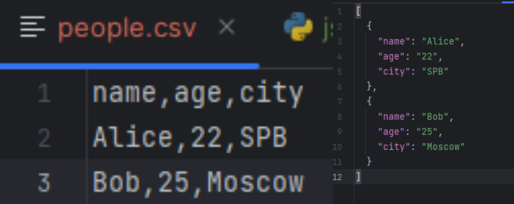
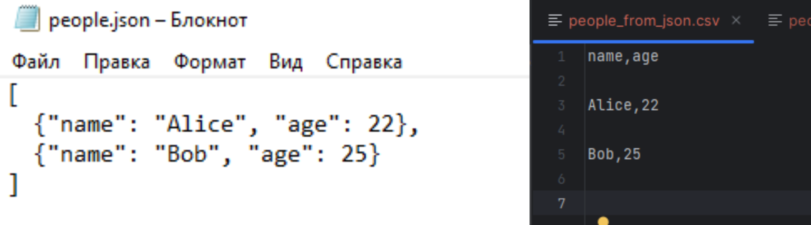


### Задание B — CSV → XLSX
```python
from openpyxl import Workbook
import csv


def csv_to_xlsx(csv_path: str, xlsx_path: str) -> None:
    """
    Конвертирует CSV в XLSX.
    Использовать openpyxl ИЛИ xlsxwriter.
    Первая строка CSV — заголовок.
    Лист называется "Sheet1".
    Колонки — автоширина по длине текста (не менее 8 символов).
    """
    wb = Workbook()
    ws = wb.active
    ws.title = "Sheet1"

    with open(csv_path, encoding="utf-8") as f:
        for row in csv.reader(f):
            ws.append(row)
        for column in ws.columns:
            mx = 0
            column_letter = column[0].column_letter
            for cell in column:
                mx = max(mx, len(cell.value))
            new_width = max(mx + 2, 8)
            ws.column_dimensions[column_letter].width = new_width

        wb.save(xlsx_path)


csv_to_xlsx('C:/Users/user/PycharmProjects/python_labs/data/lab05/samples/cities.csv',
            'C:/Users/user/PycharmProjects/python_labs/data/lab05/out/people.xlsx')
```
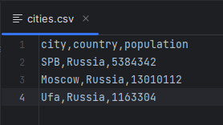
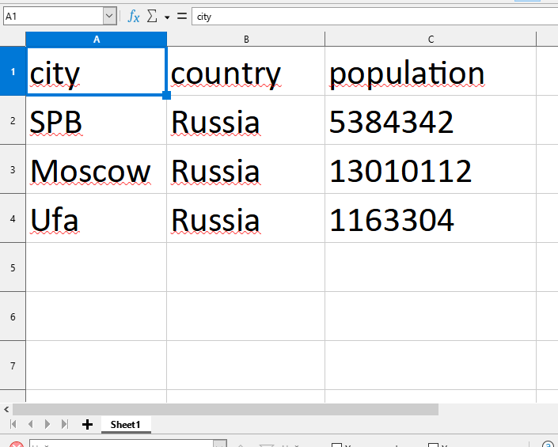


## Лабораторная работа 6

### Задание 1 - cli_text
```python
import argparse
from pathlib import Path
from src.lib.moduls import *


def main():
    parser = argparse.ArgumentParser(description="CLI‑утилиты лабораторной №6")
    subparsers = parser.add_subparsers(dest="command")

    # подкоманда cat
    cat_parser = subparsers.add_parser("cat", help="Вывести содержимое файла")
    cat_parser.add_argument("--input", required=True)
    cat_parser.add_argument("-n", action="store_true", help="Нумеровать строки")

    # подкоманда stats
    stats_parser = subparsers.add_parser("stats", help="Частоты слов")
    stats_parser.add_argument("--input", required=True)
    stats_parser.add_argument("--top", type=int, default=5)

    args = parser.parse_args()
    try:
        path_input = Path(args.input)
        sample = path_input.read_text(encoding='utf-8')

        if args.command == "cat":
            """ Реализация команды cat """
            for num, word in enumerate(sample.split('\n')):
                if args.n:
                    print(num + 1, word)
                else:
                    print(word)
        elif args.command == "stats":
            """ Реализация команды stats """
            print(
                f'Всего слов: {len(tokenize(normalize(sample)))}\nУникальных слов: {len(count_freq(tokenize(normalize(sample))))}')
            top_words = top_n(count_freq(tokenize(normalize(sample))))
            print("Топ-5:")
            for word, count in top_words:
                print(f"{word}: {count}")
    except FileNotFoundError:
        raise FileNotFoundError("Нет входного файла")


if __name__ == "__main__":
    main()
```
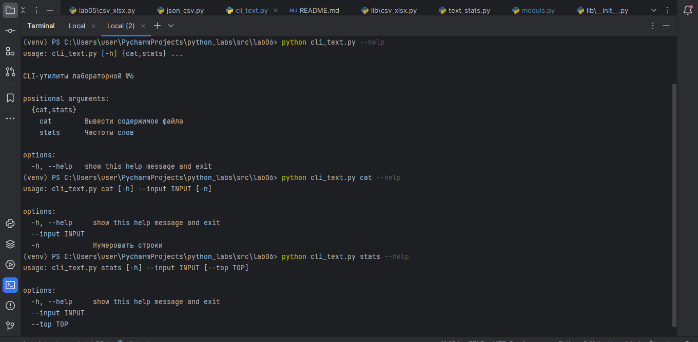
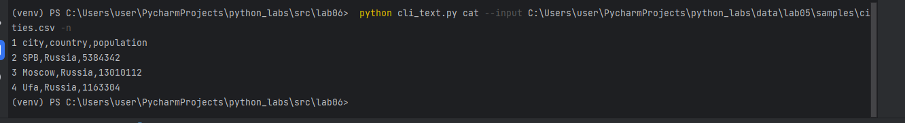
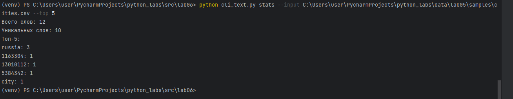

### Задание 2 - cli_convert
```python
import argparse
from src.lab05.json_csv import json_to_csv, csv_to_json
from src.lab05.csv_xlsx import csv_to_xlsx


def main():
    parser = argparse.ArgumentParser(description="Конвертеры данных")
    sub = parser.add_subparsers(dest="cmd")

    p1 = sub.add_parser("json2csv")
    p1.add_argument("--in", dest="input", required=True)
    p1.add_argument("--out", dest="output", required=True)

    p2 = sub.add_parser("csv2json")
    p2.add_argument("--in", dest="input", required=True)
    p2.add_argument("--out", dest="output", required=True)

    p3 = sub.add_parser("csv2xlsx")
    p3.add_argument("--in", dest="input", required=True)
    p3.add_argument("--out", dest="output", required=True)

    args = parser.parse_args()

    try:
        if args.cmd == 'json2csv':
            json_to_csv(args.input, args.output)
        if args.cmd == 'csv2json':
            csv_to_json(args.input, args.output)
        if args.cmd == 'csv2xlsx':
            csv_to_xlsx(args.input, args.output)
    except FileNotFoundError:
        raise FileNotFoundError('Нет входного файла')


if __name__ == "__main__":
    main()
```
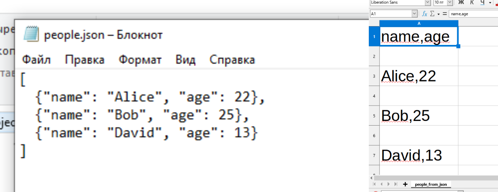
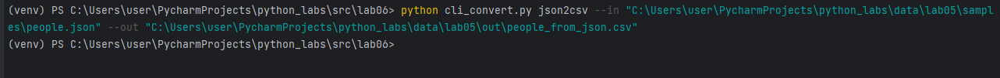
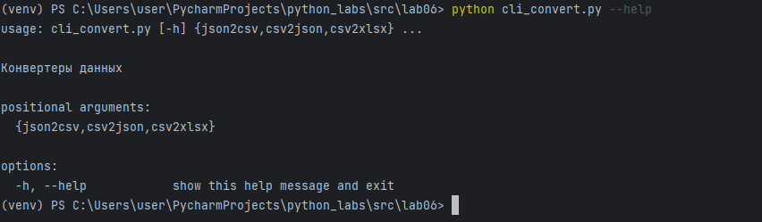


## Лабораторная работа 7

### A. Тесты для src/lib/text.py
```python
import pytest  # библиотека pytest для создания и запуска тестов
from lib.moduls import normalize, tokenize, count_freq, top_n


# параметризация для запуска одного теста с разными наборами данных
@pytest.mark.parametrize(
    "source, expected",  # параметры: source - входной текст, expected - то что должно получиться
    [
        ("ПрИвЕт\nМИр\t", "привет мир"),
        ("ёжик, Ёлка", "ежик, елка"),
        ("Hello\r\nWorld", "hello world"),
        ("  двойные   пробелы  ", "двойные пробелы"),
        ("", ""),
    ],
)
def test_normalize_basic(source, expected):
    # функция теста для normalize, берет данные из параметризации
    assert (
        normalize(source) == expected
    )  # проверяем что normalize(source) возвращает expected


@pytest.mark.parametrize(
    "source,expected",
    [
        ("привет мир", ["привет", "мир"]),
        ("hello,world!!!", ["hello", "world"]),
        ("по-настоящему круто", ["по-настоящему", "круто"]),
        ("2025 год", ["2025", "год"]),
        ("emoji 😀 не слово", ["emoji", "не", "слово"]),
        ("", []),
    ],
)
def test_tokenize_basic(source, expected):
    assert tokenize(source) == expected


def test_count_freq_and_top_n():  # тест проверяет вместе функции count_freq и top_n
    tokens = ["a", "b", "a", "c", "b", "a"]
    freq = count_freq(tokens)
    assert freq == {"a": 3, "b": 2, "c": 1}
    assert top_n(freq, 2) == [("a", 3), ("b", 2)]
    assert top_n(freq, 0) == []
    assert top_n(freq, 5) == [("a", 3), ("b", 2), ("c", 1)]
    assert count_freq([]) == {}
    assert top_n({}, 5) == []


def test_top_n_tie_breaker():  # тест проверяет top_n с одинаковыми частотами
    freq = count_freq(["bb", "aa", "bb", "aa", "cc"])
    assert top_n(freq, 3) == [("aa", 2), ("bb", 2), ("cc", 1)]
```
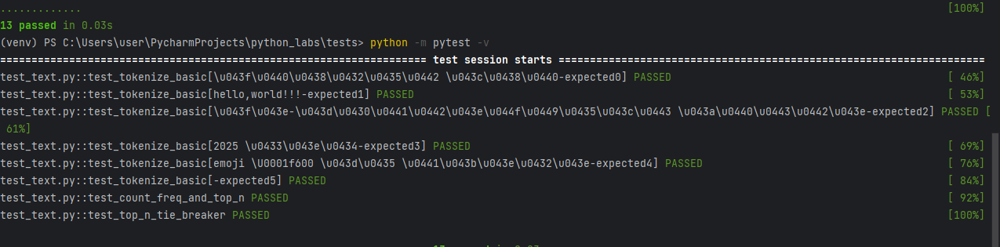

### B. Тесты для src/lab05/json_csv.py
```python
import pytest
from pathlib import Path
import csv, json
from lab05.json_csv import json_to_csv, csv_to_json


def test_json_to_csv_roundtrip(tmp_path: Path):
    src = tmp_path / "people.json"
    dst = tmp_path / "people.csv"
    data = [
        {"name": "Alice", "age": 22},
        {"name": "Bob", "age": 25},
    ]
    src.write_text(json.dumps(data, ensure_ascii=False, indent=2), encoding="utf-8")
    json_to_csv(str(src), str(dst))

    with dst.open(encoding="utf-8") as f:
        rows = list(csv.DictReader(f))

    assert len(rows) == 2
    assert {"name", "age"} <= set(rows[0].keys())


def test_csv_to_json_roundtrip(tmp_path: Path):
    src = tmp_path / "people.csv"
    dst = tmp_path / "people.json"
    rows = [
        {"name": "Alice", "age": "22"},
        {"name": "Bob", "age": "25"},
    ]
    with src.open("w", encoding="utf-8", newline="") as f:
        writer = csv.DictWriter(f, fieldnames=["name", "age"])
        writer.writeheader()
        writer.writerows(rows)

    csv_to_json(str(src), str(dst))

    data_out = json.loads(dst.read_text(encoding="utf-8"))

    assert len(data_out) == len(rows)
    assert {"name", "age"} <= set(rows[0].keys())
    assert data_out[0]["name"] == "Alice"
    assert data_out[0]["age"] == "22"


def test_json_to_csv_empty_file(tmp_path: Path):
    # пустой JSON файл - ValueError
    src = tmp_path / "sample.json"
    dst = tmp_path / "sample.csv"
    src.write_text("", encoding="utf-8")

    with pytest.raises(ValueError):
        json_to_csv(str(src), str(dst))


def test_csv_to_json_empty_file(tmp_path: Path):
    # пустой CSV файл - ValueError
    src = tmp_path / "sample.csv"
    dst = tmp_path / "sample.json"
    src.write_text("", encoding="utf-8")

    with pytest.raises(ValueError):
        csv_to_json(str(src), str(dst))


def test_json_to_csv_file_not_found():
    # несуществующий JSON файл - FileNotFoundError
    with pytest.raises(FileNotFoundError):
        json_to_csv("nonexistent.json", "output.csv")


def test_csv_to_json_file_not_found():
    # несуществующий CSV файл - FileNotFoundError
    with pytest.raises(FileNotFoundError):
        csv_to_json("nonexistent.csv", "output.json")
```
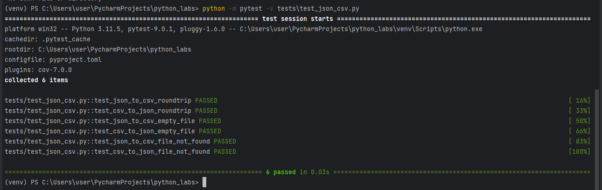

### C. Стиль кода (black)
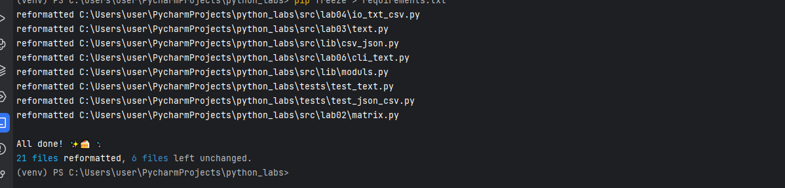


## Лабораторная работа 8

### Задание 1 A. Реализовать класс Student (models.py)
```python
from dataclasses import dataclass
from datetime import datetime, date


@dataclass
class Student:
    fio: str
    birthdate: str
    group: str
    gpa: float

    def __post_init__(self):
        try:
            datetime.strptime(self.birthdate, '%Y-%m-%d')
        except ValueError:
            raise ValueError('дата рождения должна быть в формате YYYY-MM-DD')

        if date.today().year < int(self.birthdate.split('-')[0]):
            raise ValueError('Год рождения не может быть больше чем текущий год')

        if not (0.0 <= self.gpa <= 5.0):
            raise ValueError('gpa должен находиться в промежутке от 0 до 5')

        if isinstance(self.gpa, int):
            raise ValueError('gpa должен быть в формате float')

    def age(self) -> int:
        '''возвращает количество полных лет'''
        return date.today().year - int(self.birthdate.split('-')[0])

    def to_dict(self) -> dict:
        '''сериализация объекта в словарь'''
        return {
            'fio': self.fio,
            'birthdate': self.birthdate,
            'group': self.group,
            'gpa': self.gpa
        }

    @classmethod
    def from_dict(cls, data: dict):
        return cls(
            fio=data['fio'],
            birthdate=data['birthdate'],
            group=data['group'],
            gpa=data['gpa']
        )

    def __str__(self):
        '''красивый вывод'''
        return f'ФИО студента: {self.fio}\n Дата рождения: {self.birthdate}\n Возраст: {self.age()}\n Группа: {self.gpa}\n GPA: {self.gpa}'


if __name__ == '__main__':
    student = Student(
        fio = 'Александров Александр Александрович',
        birthdate = '2006-01-25',
        group = 'BIVT-25-2',
        gpa = 4
    )
    print(student.to_dict()) # вывод в виде словаря
    print()
    print(student.from_dict(student.to_dict())) # вывод в красивом виде из словаря
    print()
    print(student.age()) # вывод полных лет
    print()
    print(student) # вывод в красивом виде

```
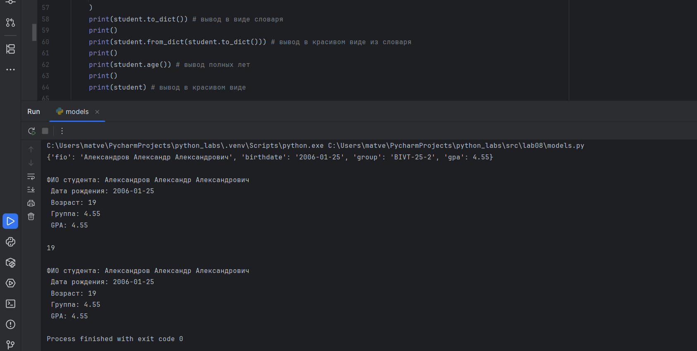
#### Валидация ошибок
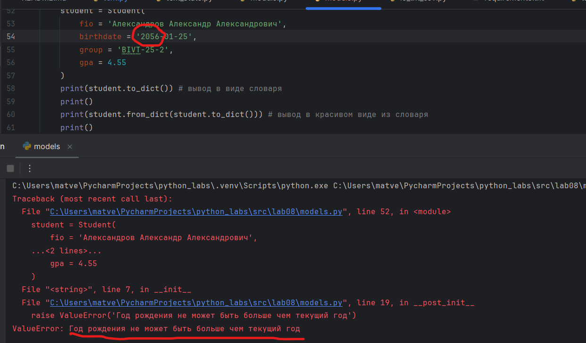
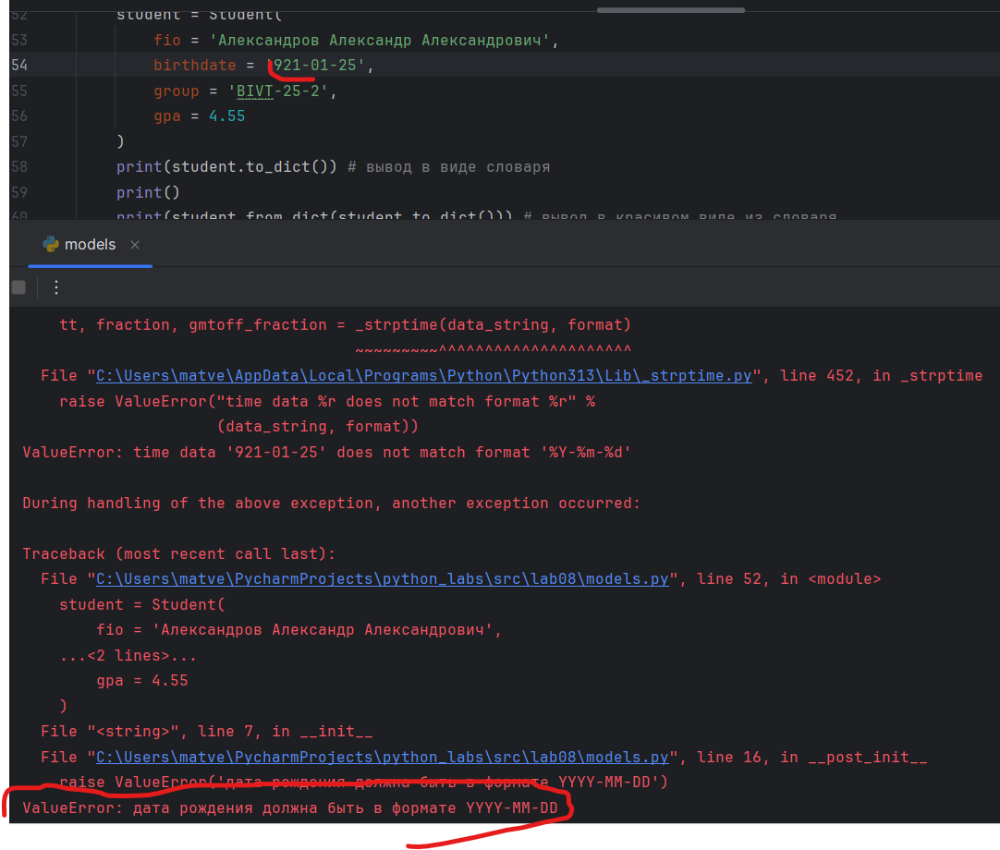
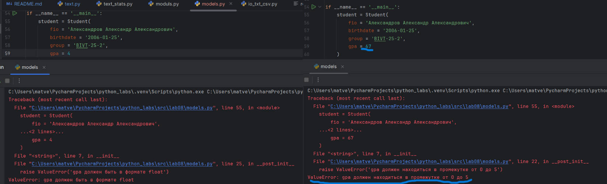


### Задание 2 B. Реализовать модуль serialize.py
```python
import csv
import os
from lab08.models import Student

headers = ['fio', 'birthdate', 'group', 'gpa']


class Group:
    def __init__(self, storage_path: str):
        self.storage_path = storage_path
        if not os.path.exists(self.storage_path):
            self._ensure_storage_exists()

    def _ensure_storage_exists(self):
        '''создать файл с заголовком, если его ещё нет'''
        with open(self.storage_path, 'w', newline='', encoding='utf-8') as file:
            csv.writer(file).writerow(headers)

    def _read_all(self):
        '''прочитать все строки из CSV'''
        students = []
        with open(self.storage_path, 'r', encoding='utf-8') as file:
            reader = csv.DictReader(file)
            for row in reader:
                students.append(
                    Student(fio=row["fio"], birthdate=row["birthdate"], group=row["group"], gpa=float(row["gpa"]), )
                )
        return students

    def _write(self, students):
        with open(self.storage_path, 'w', newline='', encoding='utf-8') as file:
            writer = csv.writer(file)
            writer.writerow(headers)
            for student in students:
                writer.writerow([student.fio, student.birthdate, student.group, student.gpa])


    def list(self):
        '''вернуть всех студентов в виде списка Student'''
        return self._read_all()

    def add(self, student: Student):
        '''добавить нового студента в CSV'''
        students = self._read_all()

        if any(student.fio == st.fio for st in students):
            raise ValueError('Такой студент уже есть')

        with open(self.storage_path, 'a', newline='', encoding='utf-8') as file:
            csv.writer(file).writerow([student.fio, student.birthdate, student.group, student.gpa])

    def find(self, substr: str):
        '''найти студентов по подстроке в fio'''
        students = self._read_all()
        for student in students:
            if substr.lower() in student.fio.lower():
                return student
            raise ValueError('Извините, такого студента нет в базе')

    def remove(self, fio: str):
        '''удалить запись(и) с данным fio'''
        students = self._read_all()
        new_list_students = []
        removed_count = 0

        for st in students:
            if st.fio.lower() != fio.lower():
                new_list_students.append(st)
            else:
                removed_count += 1

        if removed_count == 0:
            raise ValueError(f'студента с ФИО: {fio} нет в базе')

        self._write(new_list_students)

    def update(self, fio, **fields):
        '''обновить поля существующего студента'''
        students = self._read_all()
        update = False
        for st in students:
            if st.fio.lower() == fio.lower():
                for key, value in fields.items():
                    if 'fio' == key:
                        st.fio = value
                    if 'birthdate' == key:
                        st.birthdate = value
                    if 'group' == key:
                        st.group = value
                    if 'gpa' == key:
                        st.gpa = float(value)
                update = True
                break
        if update:
            self._write(students)
            return True

        return False


if __name__ == '__main__':
    student = Group('C:/Users/user/PycharmProjects/python_labs/data/lab09/students.csv')
    print(student.update('Ильин Илья Ильич', birthdate='2015-04-06', group='NEWGROUP'))

```
#### если файла students.csv нет, то создается этот файл с соответствующими заголовками
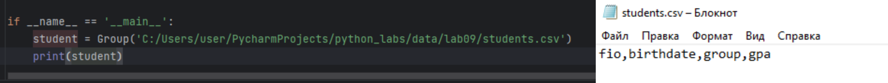
#### вернуть всех студентов в виде списка Student
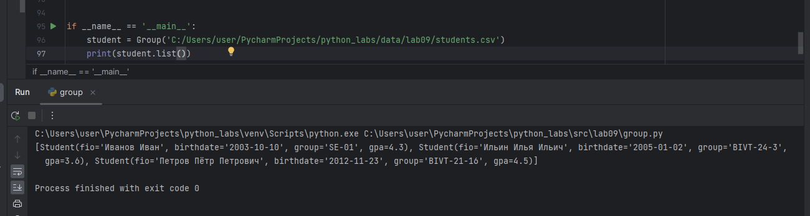
#### добавить нового студента + валидация ошибки если студент с таким именем уже есть в базе
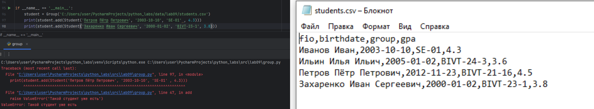
#### найти студента по имени + валидация ошибки если такого студента нет в базе
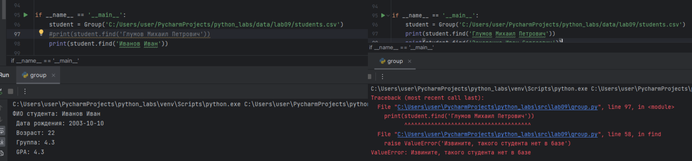
#### удаление данных студента + валидация ошибки если такого студента нет в базе
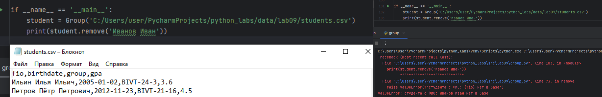
#### обновление данных студента
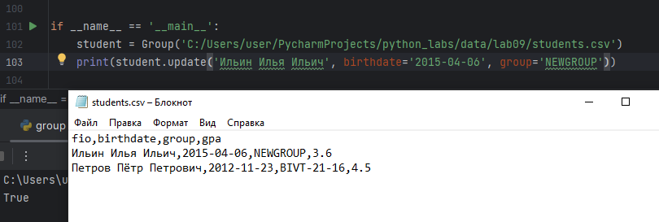

#### students.csv
```
fio,birthdate,group,gpa
Иванов Иван,2003-10-10,SE-01,4.3
Ильин Илья Ильич,2005-01-02,BIVT-24-3,3.6
Петров Пётр Петрович,2012-11-23,BIVT-21-16,4.5
```