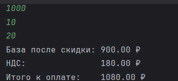

# python_labs


## Лабораторная работа 1

### Задание 1
```python
name = input('Имя: ')
age = int(input('Возраст: '))
print(f'Привет, {name}! Через год тебе будет {age+1}.')
```


### Задание 2
```python
num1 = float(input('a: ').replace(',', '.'))
num2 = float(input('b: ').replace(',', '.'))
print(f'sum={round(num1+num2, 2)}; avg={round((num1+num2)/2, 2)}')
```


### Задание 3
```python
price = float(input())
discount = float(input())
vat = float(input())
base = round((price * (1 - discount / 100)), 2)
vat_amount = round((base * (vat / 100)), 2)
total = round((base + vat_amount), 2)
print(f"База после скидки: {"{:.2f}".format(base)} ₽")
print(f"НДС:               {"{:.2f}".format(vat_amount)} ₽")
print(f"Итого к оплате:    {"{:.2f}".format(total)} ₽")

```



### Задание 4
```python
m = int(input('Минуты: '))
print(f'{m//60}:{(m-(m//60)*60):02d}')
```


### Задание 5
```python
name = input('ФИО:').upper().split()
print(f'Инициалы: {name[0][0]}{name[1][0]}{name[2][0]}')
print(f'Длина (символов): {sum(map(len, name))+2}')

```


### Задание 6
```python
n = int(input())
distance = 0
full_time = 0
for i in range(n):
    student = input().split()
    if student[-1]=='True':
        full_time += 1
    elif student[-1]=="False":
        distance += 1
print(full_time, distance)
```


### Задание 7
```python
s = input()
first_letter_pos = -1
for i, char in enumerate(s):
    if char.isupper():
        first_letter_pos = i
        break
second_letter_pos = -1
for i, char in enumerate(s):
    if char.isdigit() and i != len(s) - 1:
        second_letter_pos = i + 1
        break
print(s[first_letter_pos:-1:second_letter_pos - first_letter_pos] + '.')

```


## Лабораторная работа 2

### Задание 1
```python
def min_max(nums):
    if isinstance(nums, list) and len(nums)!=0\
            and all(isinstance(item, (int, float)) for item in nums):
        return min(nums), max(nums)
    return 'ValueError'


def unique_sorted(nums):
    if isinstance(nums, list) and len(nums) != 0 \
            and all(isinstance(item, (int, float)) for item in nums):
        return sorted(set(nums))
    return nums


def flatten(mat):
    if isinstance(mat, (list, tuple)) and len(mat) != 0 \
            and all(isinstance(item, (list, tuple)) for item in mat):
        result = []
        for item in mat:
            result.extend(item)
        return result
    return 'TypeError'
```


### Задание 2
```python
def transpose(mat):
    if len(mat) == 0:
        return []
    if isinstance(mat, list) and all(isinstance(row, list) for row in mat) and all(
            isinstance(item, (int, float)) for row in mat for item in row):
        row_lengths = [len(str(row)) for row in mat]
        if len(set(row_lengths)) != 1:
            return 'ValueError'

        return [[mat[j][i] for j in range(len(mat))] for i in range(len(mat[0]))]


def row_sums(mat):
    if len(mat) == 0:
        return []
    if isinstance(mat, list) and all(isinstance(row, list) for row in mat) \
            and all(isinstance(item, (int, float)) for row in mat for item in row):
        row_lengths = [len(row) for row in mat]
        if len(set(row_lengths)) != 1:
            return 'ValueError'
        return [sum(item) for item in mat]


def col_sums(mat):
    if len(mat) == 0:
        return []
    if isinstance(mat, list) and all(isinstance(row, list) for row in mat) \
            and all(isinstance(item, (int, float)) for row in mat for item in row):
        row_lengths = [len(row) for row in mat]
        if len(set(row_lengths)) != 1:
            return 'ValueError'
    result = []
    for col_index in range(len(mat[0])):
        sum_col = 0
        for row in mat:
            sum_col += row[col_index]
        result.append(sum_col)
    return result
```


### Задание 3
```python
def format_record(rec):
    if len(rec[0]) == 0 or len(rec[1]) == 0:
        '''пустое ФИО и пустая группа имеет аргумент правильного типа поэтому ValueError'''
        return 'ValueError'
    if type(rec[2]) is not float:
        '''неверный тип GPA имеет несоответствующий типа(например int вместо float поэтому TypeError'''
        return 'TypeError'
    if isinstance(rec, tuple):
        if isinstance(rec[0], str) and isinstance(rec[1], str) and isinstance(rec[2], float):
            name = rec[0].split()
            full_name = name[0][0].upper() + name[0][1:] + ' '
            for initials in name[1:]:
                full_name += initials[0].upper() + '.'
            return f'{full_name}, гр. {rec[1]}, GPA {"{:.2f}".format(rec[2])}'
```


## Лабораторная работа 3

### Задание 1
```python
import re

def normalize(text, casefold=True, yo2e=True):
    if isinstance(text, str) and isinstance(casefold, bool) and isinstance(yo2e, bool):
        if casefold:
            text = text.casefold()
        if yo2e:
            text = text.replace('ё', 'е')
            text = text.replace('Ё', 'Е')
        if '\t' in text or '\n' in text or '\r' in text:
            text = text.replace('\t', ' ').replace('\n', ' ').replace('\r', ' ')
    return ' '.join(text.split())

def tokenize(text):
    if isinstance(text, str):
        text = re.sub(r'[^\w-]', ' ', text).split()
    return text

def count_freq(tokens):
    if isinstance(tokens, list) and all(isinstance(item, str) for item in tokens):
        character_counting = dict()
        for i in (sorted(set(tokens))):
            character_counting[i] = tokens.count(i)
    return character_counting

def top_n(freq, n=5):
    if isinstance(freq, dict) \
            and all(isinstance(key, str) and isinstance(value, int) for key, value in freq.items()):
        sorted_items = sorted(freq.items(), key=lambda x: (-x[1], x[0]))
    return sorted_items[:n]

```

