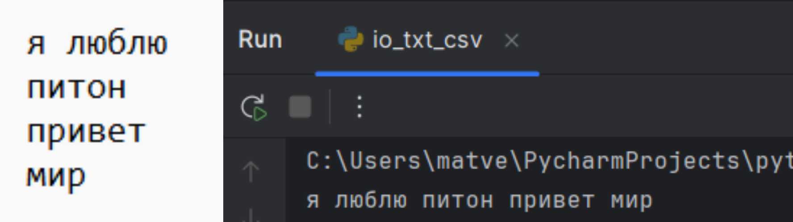

# python_labs


## Лабораторная работа 1

### Задание 1
```python
name = input('Имя: ')
age = int(input('Возраст: '))
print(f'Привет, {name}! Через год тебе будет {age+1}.')
```


### Задание 2
```python
num1 = float(input('a: ').replace(',', '.'))
num2 = float(input('b: ').replace(',', '.'))
print(f'sum={round(num1+num2, 2)}; avg={round((num1+num2)/2, 2)}')
```


### Задание 3
```python
price = float(input())
discount = float(input())
vat = float(input())
base = round((price * (1 - discount / 100)), 2)
vat_amount = round((base * (vat / 100)), 2)
total = round((base + vat_amount), 2)
print(f"База после скидки: {"{:.2f}".format(base)} ₽")
print(f"НДС:               {"{:.2f}".format(vat_amount)} ₽")
print(f"Итого к оплате:    {"{:.2f}".format(total)} ₽")

```


### Задание 4
```python
m = int(input('Минуты: '))
print(f'{m//60}:{(m-(m//60)*60):02d}')
```


### Задание 5
```python
name = input('ФИО:').upper().split()
print(f'Инициалы: {name[0][0]}{name[1][0]}{name[2][0]}')
print(f'Длина (символов): {sum(map(len, name))+2}')

```


### Задание 6
```python
n = int(input())
distance = 0
full_time = 0
for i in range(n):
    student = input().split()
    if student[-1]=='True':
        full_time += 1
    elif student[-1]=="False":
        distance += 1
print(full_time, distance)
```


### Задание 7
```python
s = input()
first_letter_pos = -1
for i, char in enumerate(s):
    if char.isupper():
        first_letter_pos = i
        break
second_letter_pos = -1
for i, char in enumerate(s):
    if char.isdigit() and i != len(s) - 1:
        second_letter_pos = i + 1
        break
print(s[first_letter_pos:-1:second_letter_pos - first_letter_pos] + '.')

```


## Лабораторная работа 2

### Задание 1
```python
def min_max(nums: list[float | int]) -> tuple[float | int, float | int]:
    if isinstance(nums, list) and len(nums) != 0 \
            and all(isinstance(item, (int, float)) for item in nums):
        return min(nums), max(nums)
    return 'ValueError'


def unique_sorted(nums: list[float | int]) -> list[float | int]:
    if isinstance(nums, list) and len(nums) != 0 \
            and all(isinstance(item, (int, float)) for item in nums):
        return sorted(set(nums))
    return nums


def flatten(mat: list[list | tuple]) -> list:
    if isinstance(mat, (list, tuple)) and len(mat) != 0 \
            and all(isinstance(item, (list, tuple)) for item in mat):
        result = []
        for item in mat:
            result.extend(item)
        return result
    return 'TypeError'
```


### Задание 2
```python
def transpose(mat: list[list[float | int]]) -> list[list]:
    if len(mat) == 0:
        return []
    if isinstance(mat, list) and all(isinstance(row, list) for row in mat) and all(
            isinstance(item, (int, float)) for row in mat for item in row):
        row_lengths = [len(str(row)) for row in mat]
        if len(set(row_lengths)) != 1:
            return 'ValueError'

        return [[mat[j][i] for j in range(len(mat))] for i in range(len(mat[0]))]


def row_sums(mat: list[list[float | int]]) -> list[float]:
    if len(mat) == 0:
        return []
    if isinstance(mat, list) and all(isinstance(row, list) for row in mat) \
            and all(isinstance(item, (int, float)) for row in mat for item in row):
        row_lengths = [len(row) for row in mat]
        if len(set(row_lengths)) != 1:
            return 'ValueError'
        return [sum(item) for item in mat]


def col_sums(mat: list[list[float | int]]) -> list[float]:
    if len(mat) == 0:
        return []
    if isinstance(mat, list) and all(isinstance(row, list) for row in mat) \
            and all(isinstance(item, (int, float)) for row in mat for item in row):
        row_lengths = [len(row) for row in mat]
        if len(set(row_lengths)) != 1:
            return 'ValueError'
    result = []
    for col_index in range(len(mat[0])):
        sum_col = 0
        for row in mat:
            sum_col += row[col_index]
        result.append(sum_col)
    return result
```


### Задание 3
```python
def format_record(rec: tuple[str, str, float]) -> str:
    if len(rec[0]) == 0 or len(rec[1]) == 0:
        '''пустое ФИО и пустая группа имеет аргумент правильного типа поэтому ValueError'''
        return 'ValueError'
    if type(rec[2]) is not float:
        '''неверный тип GPA имеет несоответствующий типа(например int вместо float поэтому TypeError'''
        return 'TypeError'
    if isinstance(rec, tuple):
        if isinstance(rec[0], str) and isinstance(rec[1], str) and isinstance(rec[2], float):
            name = rec[0].split()
            full_name = name[0][0].upper() + name[0][1:] + ' '
            for initials in name[1:]:
                full_name += initials[0].upper() + '.'
            return f'{full_name}, гр. {rec[1]}, GPA {"{:.2f}".format(rec[2])}'
```


## Лабораторная работа 3

### Задание 1
```python
import re

def normalize(text: str, *, casefold: bool = True, yo2e: bool = True):
    if isinstance(text, str) and isinstance(casefold, bool) and isinstance(yo2e, bool):
        if casefold:
            text = text.casefold()
        if yo2e:
            text = text.replace('ё', 'е')
            text = text.replace('Ё', 'Е')
        if '\t' in text or '\n' in text or '\r' in text:
            text = text.replace('\t', ' ').replace('\n', ' ').replace('\r', ' ')
    return ' '.join(text.split())

def tokenize(text: str) -> list[str]:
    if isinstance(text, str):
        text = re.sub(r'[^\w-]', ' ', text).split()
    return text

def count_freq(tokens: list[str]) -> dict[str, int]:
    if isinstance(tokens, list) and all(isinstance(item, str) for item in tokens):
        character_counting = dict()
        for i in (sorted(set(tokens))):
            character_counting[i] = tokens.count(i)
    return character_counting

def top_n(freq: dict[str, int], n: int = 5) -> list[tuple[str, int]]:
    if isinstance(freq, dict) \
            and all(isinstance(key, str) and isinstance(value, int) for key, value in freq.items()):
        sorted_items = sorted(freq.items(), key=lambda x: (-x[1], x[0]))
    return sorted_items[:n]

```


### Задание 2
```python
import sys
'''добавляем нужный нам путь в список путей, где Python ищет модули при импорте'''
sys.path.append('C:/Users/matve/PycharmProjects/python_labs/src/lib')
'''импортируем созданные ранее функции'''
from src.lib.moduls import normalize, tokenize, count_freq, top_n
data = sys.stdin.read()
data = [i.casefold() for i in tokenize(normalize(data))]
print(f'Всего слов: {len(data)}\nУникальных слов: {len(set(data))}')
f=False
if f:
    longest_word = len(max(count_freq(data), key=len))+5
    print(f'слово{(longest_word-5) * " "}| частота')
    print((longest_word + 9) * '-')
    print('\n'.join([word[0] + ' ' * (longest_word-len(word[0])) + '| ' + str(word[1]) for word in top_n(count_freq(data))]))
else:
    top_words = top_n(count_freq(data))
    print("Топ-5:")
    for word, count in top_words:
        print(f"{word}: {count}")

#hello world hello python test world hello
```


## Лабораторная работа 4

### Задание A — модуль src/lab04/io_txt_csv.py
```python
from pathlib import Path
import csv


def ensure_parent_dir(path: str | Path) -> None:
    """
    создать родительские директории, если их нет.
    аргументы:
        path: Путь к файлу или директории
    """
    path = Path(path)
    parent_dir = path.parent #получение родительской директории
    parent_dir.mkdir(parents=True, exist_ok=True) # создание директории


def read_text(path: str | Path, encoding: str = "utf-8") -> str:
    ''' открыть тестовый файл и вернуть его содержимое как одну строку
        аргументы:
            path - путь к файлу
            encoding - кодировка файла (по умолчанию utf-8,
                        но если нужна другая можно указать, например: encoding="cp1251"
        возвращает:
            str: содержимое файла как одну строку
        Ошибки:
            UnicodeDecodeError: если содержимое не подходит под выбранную кодировку
            FileNotFoundError: файл не найден
    '''
    ensure_parent_dir(path)  # создать родительскую директорию, если нужно
    try:
        with open(path, 'r', encoding=encoding) as file:
            return ' '.join(file.read().replace("\n", ' ').split())
    except UnicodeDecodeError as e:
        raise ValueError(f"Неправильная кодировка") from e
    except FileNotFoundError as e:
        raise FileNotFoundError(f"Файл не найден") from e


print(read_text('C:/Users/matve/PycharmProjects/python_labs/data/lab04/input.txt'))


def write_csv(rows: list[tuple | list], path: str | Path, header: tuple[str, ...] | None = None) -> None:
    ''' Создать/перезаписать CSV с разделителем ,
            аргументы:
            rows - строки, которые надо записать(также надо проверить чтоб длина была одинакова)
                path - путь к файлу
                header - заголовок/1 строка, если задан то записать его первой строкой
            Ошибки:
                ValueError: не каждая строка в rows имеет одинаковую длину
        '''
    p = Path(path)
    rows = list(rows)
    ensure_parent_dir(p)  # создать родительскую директорию, если нужно

    ''''проверка, что все строки имеют одинаковую длину'''
    if rows:
        first_length = len(rows[0])
        for i, row in enumerate(rows):
            if len(row) != first_length:
                raise ValueError(f"Строка {i+1} имеет длину {len(row)}, ожидается {first_length}")

    '''проверка совпадения длины header с длиной строк'''
    if header is not None and rows:
        if len(header) != len(rows[0]):
            raise ValueError(f"Header имеет длину {len(header)}, а строки - {len(rows[0])}")

    with p.open("w", newline="", encoding="utf-8") as f:
        w = csv.writer(f)
        if header is not None:
            w.writerow(header)
        for r in rows:
            w.writerow(r)


write_csv([("word","count"),("test",3)], "C:/Users/matve/PycharmProjects/python_labs/data/lab04/check.csv")
```



### Задание B — скрипт src/lab04/text_report.py
```python
import sys
'''добавляем нужный нам путь в список путей, где Python ищет модули при импорте'''
sys.path.append('C:/Users/matve/PycharmProjects/python_labs/src/lib')
'''импортируем созданные ранее функции'''
from src.lib.moduls import normalize, tokenize, count_freq, top_n
from io_txt_csv import read_text, write_csv

def console_output(text): # вывод в консоль из файла input.txt
    tokens = top_n(count_freq(tokenize(normalize(text))))
    return f'Всего слов: {len(tokens)}\nУникальных слов: {len(set(tokens))}\nТоп-5:\n{'\n'.join((f'{i[0]}:{i[1]}' for i in tokens))}'

def from_file_to_text(path, encoding='utf-8'): # перевод содержимое файла input.txt в единую строку
    return read_text(path, encoding=encoding)

def frequencies_from_text(text: str) -> dict[str, int]: # токенизация, нормализация, счет частоты слов из ЛР3
    tokens = top_n(count_freq(tokenize(normalize(text))))
    return tokens

def text_to_csv(rows, path='C:/Users/matve/PycharmProjects/python_labs/data/lab04/report.csv', header=("word", "count")):
    # запись в scv
    # если файл input.txt - пустой, то в файле report.csv только заголовок
    return write_csv(rows, path=path, header=header)

text_to_csv(frequencies_from_text(from_file_to_text('C:/Users/matve/PycharmProjects/python_labs/data/lab04/input.txt')))
print(console_output(from_file_to_text('C:/Users/matve/PycharmProjects/python_labs/data/lab04/input.txt')))
```


